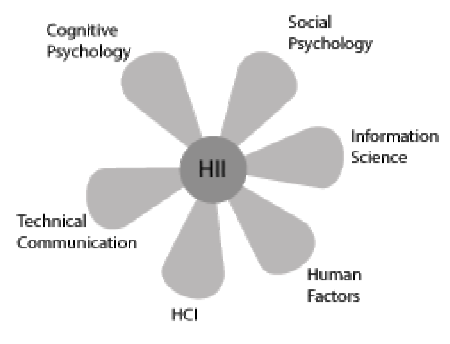
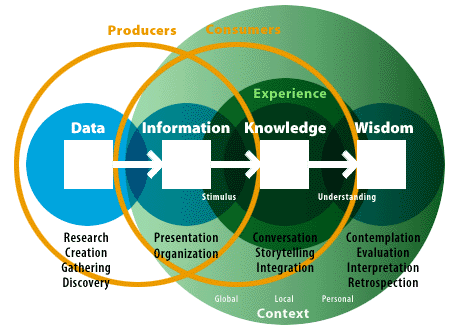
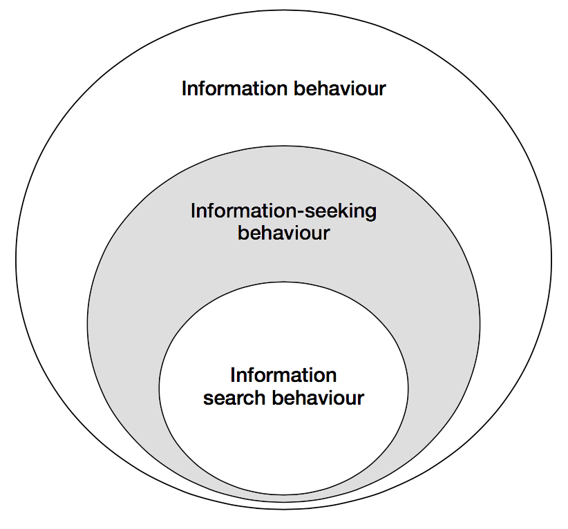
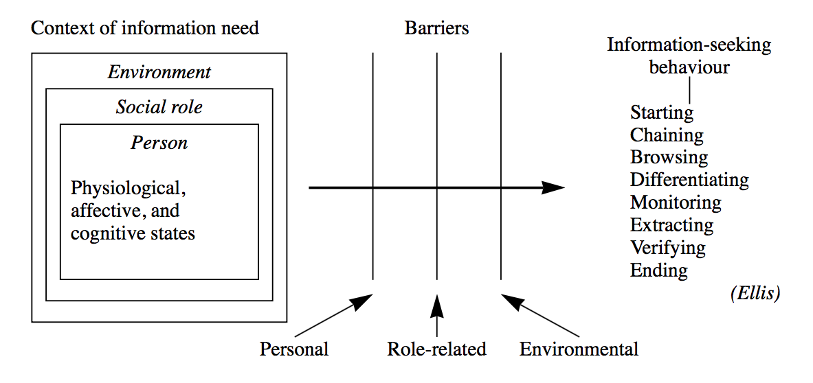
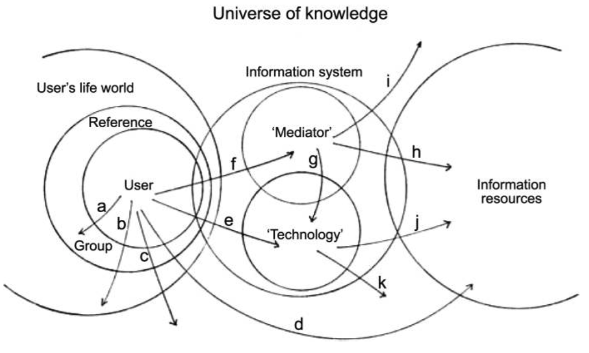
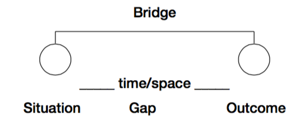
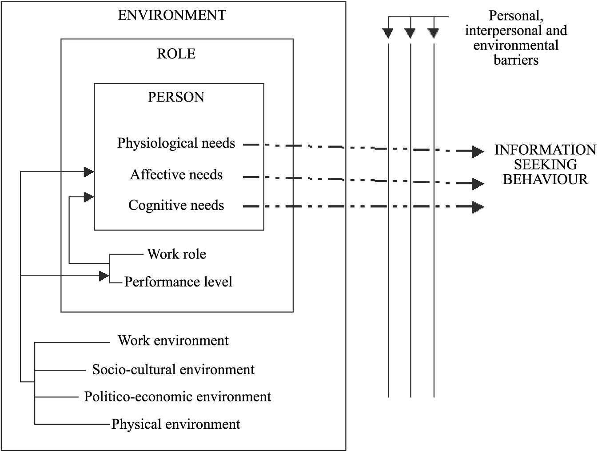
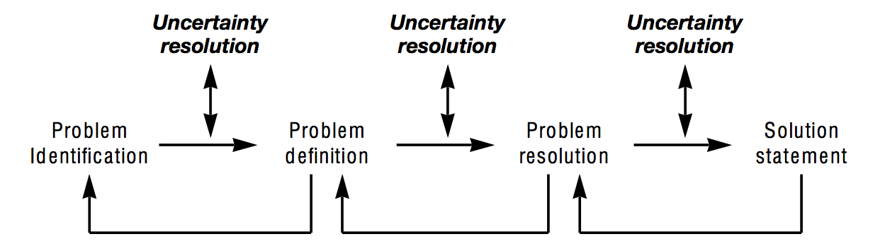

## 3. CONCEPTUAL FRAMEWORK
>*“Overload, clutter, and confusion are not attributes of information, they are failures of design.”*
>
(Tufte, 2011 as seen in ????){++REF++}

This section of the paper aims to improve understanding of the theoretical underpinnings of HII and information design—two young, emerging fields that have roots in more traditional fields of  library and information science (LIS), PIM, HCI, IS design, and design science. Moreover, it serves as a theoretical framework for the analysis presented later on. First, the basic concepts and terminology are examined, as to clarify their meaning for paper’s purposes and to avoid confusion. Next, a brief history of the changing role of the design is presented. The section concludes with conceptual models that have been chosen as relevant for the analysis.

According to Schrader, who studied 700 definitions of “information science” from 1900 to 1981, “the literature of information science is characterized by conceptual chaos” (as cited in Myburgh, 2005, p. 13). Rapid technological advances, widespread adoption of portable computing devices, and growing ubiquitous access to the Internet have characterized the turn of the 21st century (eMarketer, 2014a, 2014b; Internet Live Stats, n.d.). This has lead to a growing realization of the central role information plays in our everyday lives, and to a further conceptual and semantic confusion surrounding IM's core terms like data, information, and knowledge (Myburgh, 2005).

To accommodate for the ambiguity in terminology and interpretation of concepts, this paper takes a strong interpretivist view rooted in social construction, looking  “for culturally derived and historically situated interpretations of the social life-world” (Crotty, 1998, p. 67). It strives to avoid a pitfall of false dichotomies that separate analytical concepts into neatly confined boxes with limited applicability to real world problems, if taken at face value. In this view, virtually any claim is valid to a greater or lesser degree. While this allows for a substantial freedom in the analysis, it also renders the outcomes of the analysis inconclusive. In other words, this paper claims to provide a “good enough” solution to a research problem at hand, but it does not (and by the definition it cannot) conclude with an all-encompassing answer with a single “correct” solution. The entire paper is based on this modus operandi.

The paper’s pragmatic nature stems from a phenomenological tradition in which the object and the subject are inherently interlinked—one cannot be adequately described without the other (Crotty, 1998). Rather than trying to objectify and isolate some sort of “reality out there,” the focus is on human experience of the world, not the world itself (Fidel, 2012). It studies the differences in the interpretations of the world and what aspects of our everyday life and environment affect these interpretations and how. In this view, the object of study is not information itself, but rather the role information plays in a wider context of work, study, and life in general (Bawden & Robinson, 2012; Wilson, 2006). The paper looks specifically for the role information plays in the context of travel.

The underlying goal of this paper is to go beyond HCI, which has traditionally been concerned with the study of PIM and information needs in IS design. In the world where people are drowning in data, HCI “has not really kept pace with the changes in technology” (Benyon, 2001, p. 426). This system-centric view sees the user as outside the computer and focuses primarily on how people manipulate data through interfaces. It investigates how people consume information, rather than how they comprehend it and integrate it in the broader context(s) of their everyday lives. What we call information systems, are in fact, often just data-manipulation systems. The design of these systems is usually driven by the capabilities of the given technology, rather than by the information needs of the end-user (Albers, 2008; Benyon, 2001; Wilson, 2000).

The growing realization of the inadequacy of HCI to cope with increasingly information-dense nature of everyday life has lead to an emergence of a new field of HII. This field has marked a “a philosophical shift of privileging the human’s interaction with the information, rather than the human’s interaction with the computer interface” (Albers, 2008, p. 117). This naturalistic view sees technology merely as an enabler, not the point of interest. It moves the human actor from outside to inside an information space in which “people must perceive and interpret the information artefacts so that they can achieve their goals in an activity space.” (Benyon, 2001, p. 429). The focus is on “on people interacting with information and solving problems” (Albers, 2008, p. 118) in an activity space, where their everyday experiences occur. HII strives to uncover how people conceive information, rather than just perceive it (Benyon, 2001). At the end of the day, a “person does not want to use a web-based information system or a computer application; they want to accomplish a real-world goal”  (Albers, 2008, p. 118). The term human information behavior (HIB) is sometimes used to describe essentially the same concept as HII. In this paper, the term HII is preferred, but both can be used interchangeably (Jones, 2012; Jones & Teevan, 2007). The Figure 1 illustrates the multidisciplinary nature of the field. 

<figure>
	
	<figcaption><b>Figure 1. Fields involved in successful communication of technical information.  Adapted from Albers (2008)</b></figcaption>
</figure>

### 3.1 Terminology goulash

As mentioned earlier, there is quite a bit of conceptual confusion and a lack of consensus surrounding many of the terms central to the study of IM, and the various disciplines it encompasses. The word “information” is understood differently if one is an engineer developing a new enterprise intranet, than if one is a communications expert analyzing a political debate on television. One sees it purely as a resource existing independent of the human mind, while the other one sees it as product of human interaction. The following is a rough delineation of some of the key terms used throughout the paper and how they are understood for the purposes of this research.

**Data**

Data is a raw representation of something factual and quantifiable. It is created through measurement and direct observation. Moreover, it can be received, stored, processed, and transmitted by humans, computers, and other mediums (Myburgh, 2005). Data do not have an intrinsic discrete meaning and are therefore not an adequate product for communication (Myburgh, 2005; Shedroff, 2000). To obtain value from data, it must be transformed, organized, and given meaning. Once a human actor has made sense of data, it becomes information. Data can be subsumed under information in a sense that “data may or may not be information depending upon the state of understanding of the information user” (Wilson, 2000, p. 50).

**Information**

Information is a product of human interaction with data and that “part of an individual's knowledge which can be communicated, which has meaning and which can be understood by other individual” (Myburgh, 2005, p. 24). Information has meaning, as opposed to data. The term is often conflated with the terms data and knowledge, as it is typically used to describe different things in different contexts. In the early study of IM, information has been seen as something that can exist independent of the human mind and the medium that is used to carry it. In this system-centric view, the information is objectified and seen mainly as a resource to be managed and manipulated. However, the now more established notion sees information exclusively as a product of a communicative interaction process set in a certain context (Bawden, & Robinson, 2012). When we talk about information as an independent entity residing outside of the human mind, we are talking about an information item or an information artifact. That is the “packaging of information in a persistent form than can be acquired, created, viewed, stored, grouped (with other items), moved, given a name and other properties, copied, distributed, moved, deleted, and otherwise manipulated” (Jones & Teevan, 2007, p. 7). Another term used for an information item is a document, which refers to any recording of information (Myburgh, 2005).

**Knowledge**

In broad terms, knowledge can be described as “that which people know and is accumulated through understanding, interpreting, analysing and making meaning of what is experienced and observed, as well what others have communicated” (Myburgh, 2005, p. 22). It is derived from both data and information and depends on personality and intellect. Therefore, everyone possesses a highly personal unique body of knowledge that resides inside his or her head. There have been attempts to separate knowledge from the human mind to a certain degree. Management studies in particular have grown fond of the notion of the tacit knowledge, popularized by Nonaka (1991). This view argues that an organization can tap into knowledge hidden in the heads of the organizational members by devising appropriate methods and processes to translate tacit knowledge into explicit knowledge that can be communicated to the rest of the organization. This again suggests a rather system-centric view, where knowledge is treated as a commodity to be captured, codified, and seen primarily as an organizational asset. In the tradition of Polanyi (Tsoukas, 2003), this paper treats knowledge as something highly situated and entirely ineffable. It cannot be transmitted, only information about the knowledge can, and “that information can only ever be an incomplete surrogate for the knowledge” (Wilson, 2000, p. 50). When a person interacts with information and uses it to solve a problem or achieve a specific goal, knowledge can also be seen as information in action (Hughes, 2002). The concept of wisdom is beyond the scope of this paper, and it is simply regarded as a highest form of knowledge that has accumulated over a long period and is impossible to communicate.

<figure>
	
	<figcaption><b>Figure 2. The Understanding Spectrum. Illustration of the relationships between the key terms. Adapted from Shedroff (2000)</b></figcaption>
</figure>

**Information behavior**

Wilson described information behavior as “the totality of human behavior in relation to sources and channels of information, including both active and passive information seeking, and information use” (Wilson, 2000, p. 49). This broad term includes face-to-face communication, as well as a more passive reception of information with no intention to “act on the information given” (Wilson, 2000, p. 49). Research into information behavior has, for a long time, been dominated by an inquiry into the cognitive dimension of human life. Human-information interaction is a cognitive process after all—not a social or physical one. However, this perspective severely underplays, or completely ignores, the role of other dimensions like social or environmental (Fidel et al., 2004). It is therefore necessary to adopt a more multidimensional, ecological approach that also includes the social dimension which “views the human as a person who lives and acts in a certain context, rather than a user of information systems and services” (Fidel, 2012; Fidel et al., 2004). The ecological approach to HII starts with the study of environmental constraints before moving onto the investigation of cognitive constraints. In this view, “interacting with information is a way to overcome an obstacle in solving a problem” (Fidel, 2012, p. 7). The importance of the information itself is downplayed in favor of examining the problem-based and pragmatic nature of the interaction since “most of the time, people are trying to solve problems, to make sense of the world, and to do things, not find information for its own sake” (Bawden, & Robinson, 2012, p. 205). Human processing of information is not seen as a static input-output process, but rather as a continuous act of sense-making which “focuses on how people understand information they receive within their life context, with factors such as the person’s expertise, social position, and situation affecting their understanding” (Fidel, 2012, p. 59). Information behavior as a research area is too broad for the purposes of this paper. A subset of information-seeking behaviour, which is concerned with the information needs, has been chosen as a primary area of research, and is illustrated in Figure 3. Information search behavior is “the ‘micro-level’ of behavior employed by the searcher in interacting with information systems of all kinds” (Wilson, 2000, p. 49). It focuses on the interaction with the system at both the interface and the intellectual level. For the analysis’s purposes it is implicitly contained within the term information-seeking behaviour.

<figure>
	
	<figcaption><b>Figure 3. A nested model of the information seeking and information searching research areas. Shading added by the author to highlight the area of interest. Adapted and modified from Wilson (1999)</b></figcaption>
</figure>

**Information needs**

Information need is a secondary human need that arises out of more basic, primal needs (Wilson, 1999). In this problem-based view, information is seen as a tool people use to cross a barrier they encounter when they try to achieve something, such as obtaining food, finding shelter, satisfying their curiosity. Here the information need is defined by uncertainty and an “actor’s realization that she misses something that is required to move from one situation to another” (Fidel, 2012, p. 176)(Wilson, 2006). Wilson (2006) suggests that the term information need implies a concrete entity residing in an actor’s mind, and the goal of a researcher is to simply figure out what these needs are. Assumingly, this simplistic conceptualization of the information needs is the reason behind a relatively low effectiveness of traditional consumer research in terms of figuring out the actual desires of people (Gócza, n.d.). Wilson goes on to suggest that we instead speak of “information seeking towards the satisfaction of needs” which sees the “full range of human, personal needs […] at the root of motivation towards information-seeking behavior” (Wilson, 2006, p. 665). This perspective suggests a more complex interplay of human mind, context, social setting, and environmental constraints (see Figure 4). Information needs are then seen as being an abstract concept in a constant state of flux, always changing depending on the current context, broader socio-psychological state, and the current role of the information user.

<figure>
	
	<figcaption><b>Figure 4. Wilson’s model of information-seeking behaviour. Adapted from Wilson (1999)</b></figcaption>
</figure>

Much of the study of information-seeking behavior revolves around a single role in a person’s life. Most notably, organizational and management studies often consider only the work role of the people, ignoring their active roles as parents, students, politically engaged citizens, and countless other roles people take on over the course of a single day (Wilson, 2006). As mentioned in the previous section, investigation in a single context is not inherently an exercise in futility, but it is necessary to acknowledge that people might occupy several roles simultaneously and that there is always an array of contexts influencing a task-at-hand. Figure 5 serves as a good illustration of the complexity involved in a seemingly simple act of looking for information using only a single information system.

<figure>
	
	<figcaption><b>Figure 5.The context of information seeking. Illustrates a variety of overlapping contexts when using a single information system, lettered paths show some of the possible search paths. Adapted from Wilson (2006)
</b></figcaption>
</figure>

**Actor**

There are various terms used to describe a person interacting with an IS. Librarians call such people patrons. In the corporate context they are sometimes referred to as clients. Undoubtedly, the most widely used term is users. “All these terms include only those who actually use a system and ignore potential users who may also benefit from using it” (Fidel, 2012, p. 4). On the other hand, the term actor implies a sense of agency and shifts the focus from the system to the participant, who has an existence outside of the information system. It highlights the importance of HII taking place in a context(s) of activities. Furthermore, this conceptualization forces us to also consider the nonusers, who may be reluctant to use an IS because their information needs have not been satisfied (Fidel, 2012).

### 3.2 Design meets information
With the rapid adoption of the World Wide Web in the last two decades, the term “designer” became strongly associated with a small subset of digital design. Today, when we say designer, most people think of a person that builds websites, creates screen-based interfaces, and is concerned primarily with the digital medium. However, design as a craft is much older than the Internet culture would lead us to believe. If taken in its broadest sense, design has always been here, and is in one of the most fundamental human activities. In the words of  one of the founding fathers of modern human-centered design:

> All men are designers. All that we do, almost all the time, is design, for design is basic to all human activity. The planning and patterning of any act toward a desired, foreseeable end constitutes the design process. Any attempt to separate design, to make it a thing-by-itself, works counter to the fact that design is the primary underlying matrix of life.
> 
(Papanek, 1979, p. 3)

Design as a stand-alone field of study is relatively new. Until the World War II, the study of design was mostly conflated with the history of art and architecture, sociocultural anthropology and archeology. With the study of materials, technological constrains, and indigenous building methods on the one hand. And examining the relationships between people, design and environment on the other. Historically, there were primarily two types of designers. The do-it-all master generalists, the likes of Leonardo Da Vinci, who have engaged in every conceivable act of creative endeavor and have designed virtually entire cities for their patrons. And then a more specialized craftsmen, who have mastered the art of design through family business know-how accumulated over generations, or through tapping into collective knowledge of guilds.

With rapid technological advances, further accelerated by two World Wars, this was about to change.

Accelarated pace of technology advances caused by war and contries pressed for resources.

**Rise of an industrial designer**

nobody called them designers

with the need for specialization and for effective use of building material in countries pressed for resources by the war. a rise of industrial designer.

ergonomics...

UX

According to Papanek today's designers are victims of tyranny of absolute choice. (p. 49). “When everything becomes possible, when all the limitations are gone, design and art can easily become a never-ending search for novelty, until newness-for-the-sake-of-newness becomes the only measure.”

We can see this all around the Internet community. Be it a preference for using the newest frameworks in the development community ({++ link to frameworks article ++}REF.) or erosion of visual variety through flat design, with its insistence on minimalism and lack of visual gimmicks {++ add links to end of designer, flat UI ++}.

- "Best Interface is No Interface" - industry calls for more seamless solutions not involving screens. Like Ford "kick" mechanism sensitive to the context of opening a trunk with you hands full of shopping bags.

- The launch of the first Apple iPhone in 2007 marked a beginning of an era of completely “different tactile relationship to information” (http://breakingsmart.com/season-1/introduction-by-marc-andreessen/). Thought touch screens have been around for longer, iPhone pushed the industry to produce 

- “the continual development of rich interaction techniques and tools to support user’s ability to create and shape external representations of knowledge that ultimately support more effective situation awareness and understanding.”  (Pirolli, & Russell, 2011, p. 2).

- design with humans as central point of research during the design process roots in industrial design
- industrial design operating in a more structured environment (A22)
- where the purpose and utility of the environmental data has already been established - e.g. drive a car, operate a motor vehicle, fly a t….
- adapting to environment (ergonomy) not interacting with endless flow of data
- “these semantic aspects of communication are irrelevant for the engineering problem” (A26)
- put image of stable environmental Dreyfuss, image community network
- design informed by humans not system capabilities (B4: 79)
- shift from UX and visual design, to information design (A18)
- challenge menu drivven systems (B4: 66)
- They worked in a much more stable environment where tools had an obvious purpose and their role was clear. Digital world, the online one in particular, is an ephemeral and ever-changing. 
-  relying heavily on menu-driven interfaces defined by often arbitrary taxonomies (Cooley, 2000). 
- “Design is the conscious and intuitive effort to impose meaningful order.” (Papanek, 1984)
- “the continual development of rich interaction techniques and tools to support user’s ability to create and shape external representations of knowledge that ultimately support more effective situation awareness and understanding.”  (Pirolli, & Russell, 2011, p. 2).
- a context-specific information system (Fidel 2012; 14)
- information architecture - top-down organizational schemes and semantic taxonomies
new kid on the block: information design, inside-out approach, less algorithmic and systematic and more organic and sensitive to a particular context of use

### 3.3 Relevant models
Models in HII research can be divided into three main categories: descriptive, process, and complex. Descriptive models take a form of a simple diagram or a list, as their function is to merely list “the factors and activities involved in the aspects of information behaviour being considered” (Bawden, & Robinson, 2012, p. 193). Process models introduce a certain enumeration to the study of information behavior by showing what happens in what order. They are often represented as flow-charts or process diagrams, and are probably most widely used (Bawden, & Robinson, 2012). The most advanced models “introduce a greater degree of context and an increased number of perspectives, and are typically non-linear or multidirectional, rather than having a single sequence of steps” (Bawden, & Robinson, 2012, p. 197). These complex models capture more of the complexity of information behavior, but they are also much harder to apply in a reasonable manner. Due to the scope of the project and lack of sufficient longitudinal data, this paper utilizes the simpler process models, while acknowledging the lower explanatory power of applying these models.

The problem-based nature of the information-seeking behavior fits well with the notion of sense-making—a term commonly encountered in the literature on HCI and HII. It is “framed as the process of forming and working with meaningful representations in order to facilitate insight and subsequent intelligent action” (Pirolli, & Russell, 2011, p. 1). However, it cannot be seen simply as a model of information-seeking behavior, it is, rather, a set of assumptions, theoretical perspectives, and methodological approaches which serve as an overall framework for the study of how people interpret, and make sense of the world around them (Wilson, 1999). This paper utilizes the Dervin’s Sense-Making theory as conceptualized by Wilson (1999), and is illustrated in Figure 6. A situation is set in time and space, and defines the context in which information problem arises. A gap is defined by uncertainty, and represents the difference between the contextual situation and the desired situation. An outcome is the consequence of the Sense-Making process. A bridge is some means of closing the gap between situation and outcome (Wilson, 1999).

<figure>
	
	<figcaption><b>Figure 6. Dervin’s Sense-Making framework modified. Adapted from Wilson (1999)</b></figcaption>
</figure>

The first model used in the analysis is the “information needs and seeking” conceptualization as proposed by Wilson (2006), and illustrated in Figure 7. This model will be used to investigate the environmental, socio-psychological, and role-based constraints, and will set the actor in a broader context of travel. Information seeking is seen as a way to satisfy more primal needs.

<figure>
	
	<figcaption><b>Figure 7. Information needs and seeking. Adapted from Wilson (2006)</b></figcaption>
</figure>

Second is the “problem solving model of the information seeking and searching process” as proposed by Wilson (1999), and illustrated in Figure 8. This model moves closer to the human mind, and will be used to take a closer look at how an actor uses information to gradually lower uncertainty and reach a solution to a travel-related problem.

<figure>
	
	<figcaption><b>Figure 8. A problem solving model of the information seeking and searching process. Adapted from Wilson (1999)</b></figcaption>
</figure>